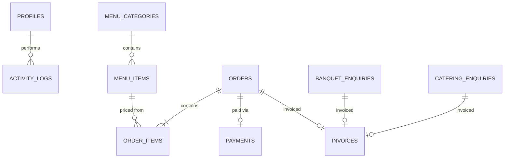
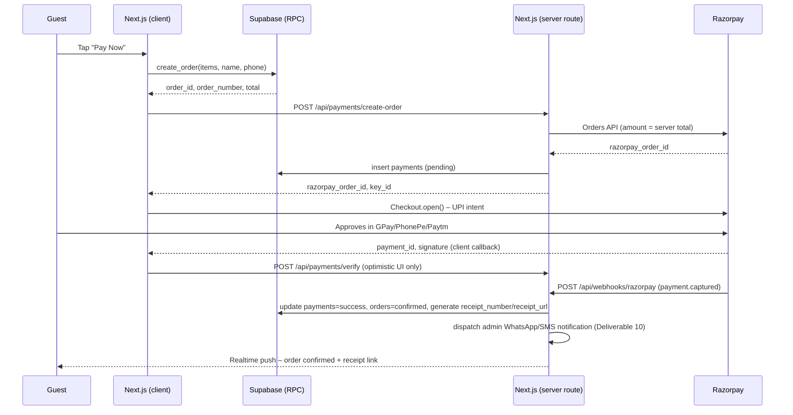

# Restaurant, Banquet & Catering Platform

**Technical Architecture — Akshaya Hospitality Group**

A Supabase-backed ordering and booking system extending the existing Akshaya marketing site: guest checkout in five clicks or fewer, enquiry capture for banquet and catering, and a role-based admin console for leads, orders, payments, and invoicing.

**Stack:** Next.js 15 (App Router) · TypeScript · Tailwind + shadcn/ui · Supabase (Postgres / Auth / Realtime / Storage) · Razorpay · Vercel

---

## Contents

1. [Assumptions & integration decisions](#assumptions--integration-decisions)
2. [Implementation plan](#deliverable-01--step-by-step-implementation-plan)
3. [Database schema](#deliverable-02--full-database-schema)
4. [Supabase setup guide](#deliverable-03--supabase-setup-guide)
5. [API / RPC structure](#deliverable-04--api--rpc-structure)
6. [Payment integration flow](#deliverable-05--payment-integration-flow)
7. [5-click UX wireframes](#deliverable-06--5-click-ux-wireframes)
8. [Folder structure](#deliverable-07--folder-structure)
9. [RLS policies](#deliverable-08--rls-policies)
10. [Admin dashboard structure](#deliverable-09--admin-dashboard-structure)
11. [Receipts, no-cash enforcement & notifications](#deliverable-10--receipts-no-cash-enforcement--notifications)

---

## Assumptions & integration decisions

This spec extends the Akshaya marketing site already scaffolded at `akshaya-restaurant/` (Next.js 15, TypeScript, Tailwind) rather than starting a second project. Four calls were made to turn the brief into something buildable — flag any of these if they're wrong and the affected sections update accordingly.

| Decision | Call made | Why |
|---|---|---|
| Gateway | Razorpay over PhonePe | UPI intent + collect, native order/payment/refund APIs, webhook signing out of the box — matches your own "recommended". |
| Landing hero | Keep the cinematic hero; swap its single CTA for a 3-tile service picker | The brief's "full-screen 3-option selection" and the existing storytelling hero aren't in conflict — the tiles become the hero's primary action, story continues below the fold. |
| Order pricing | Server-computed only, via RPC | Never trust a client-supplied price for a real payment; the RPC reprices every line from `menu_items`. |
| UI kit | shadcn/ui on top of the existing Tailwind v4 tokens | Fastest path to accessible cart/checkout/admin primitives without fighting the brand palette already defined in `globals.css`. |
| Payment methods | UPI/Razorpay only — no cash, no COD path anywhere in the schema | Brief's hard requirement; enforced structurally (no `payment_method` enum value for cash exists, `orders.status` can only reach `confirmed` via a `payments.status = 'success'` row written by the webhook) rather than by a runtime check that could be bypassed. |
| Receipt vs. invoice | Two separate artifacts, not one | A receipt confirms *payment was captured* (auto-generated the moment the webhook fires, no GST logic); a PI/TI invoice is a *billing document* (generated on staff action, carries GST). Conflating them would block instant payment confirmation behind invoice/GST decisions that shouldn't gate it. |
| Leads export | `.xlsx` (built) + Google Sheets (new) | Brief prefers Sheets integration; xlsx stays as the no-setup fallback since Sheets requires the owner to authorize a Google service account. |
| Admin notifications | WhatsApp Business Cloud API (primary) + SMS via Twilio (fallback), fired from `activity_logs` inserts | Brief marks this optional; piggybacking on the existing `activity_logs` write (already happens on every order/enquiry) avoids a second notification-specific write path. |

> **Not in scope here:** this document is the architecture and schema. Once you sign off on it, implementation happens as a normal set of PRs against the existing repo — migrations first, then RPCs, then UI.

---

## Deliverable 01 — Step-by-step implementation plan

Nine phases, each shippable and demoable on its own. Payments only go live at the end of Phase 4, behind a test-mode Razorpay key.

**Phase 0 — Supabase project & auth foundation**
Create the project, enable email+password auth for staff, seed the `profiles` table trigger, wire environment variables into Vercel.

**Phase 1 — Schema, indexes, RLS**
Run every migration in [Deliverable 02](#deliverable-02--full-database-schema), apply every policy in [Deliverable 08](#deliverable-08--rls-policies), and write a seed script for menu categories/items so the ordering UI has real data on day one.

**Phase 2 — Service picker & menu browsing**
Replace the hero's single CTA with the three service tiles; build `/order` as a read-only category/menu browser against Supabase, no cart yet.

**Phase 3 — Cart & guest checkout**
Client-side cart store, sticky cart drawer, one-page checkout collecting only name + phone. Calls `create_order()` RPC on submit.

**Phase 4 — Razorpay + webhook**
Order-create route, Razorpay Checkout intent, webhook handler that flips `payments.status` and `orders.status` atomically, and on success generates the auto payment receipt (Deliverable 10). This is the first phase real money can move — ship it behind Razorpay test mode until QA signs off.

**Phase 5 — Banquet & catering enquiries**
`/banquet` and `/catering` forms, both writing to their own tables and to `leads` in one transaction (RPC again, same reasoning as orders: never trust two separate unguarded inserts from the client).

**Phase 6 — Admin console**
Role-gated `/admin`: Leads, Orders, Payments views wired to Supabase Realtime so new orders appear without a refresh.

**Phase 7 — Invoicing**
PI/TI generation on order confirmation, GST toggle in Owner settings, PDF rendered server-side and stored in Supabase Storage.

**Phase 8 — Activity log, xlsx/Sheets export & admin notifications**
`activity_logs` writes from every RPC and admin mutation; Leads dashboard gets "Export to Excel" and "Export to Google Sheets" buttons backed by route handlers; the same `activity_logs` insert on `order.created`/`enquiry.created` triggers the WhatsApp/SMS admin notification (Deliverable 10).

**Phase 9 — Hardening & launch**
RLS policy audit against every table, rate limiting on the three public insert paths (leads, enquiries, order-create), load test the checkout path, flip Razorpay to live keys.

---

## Deliverable 02 — Full database schema

Twelve tables. Money columns are `numeric(10,2)`, never float. Every table that a webhook or RPC writes to has a `created_at`/`updated_at` pair for audit; every foreign key that matters to a dashboard query is indexed.

### Enums

```sql
-- 001_enums.sql
create type user_role as enum ('owner', 'admin', 'staff');
create type order_status as enum ('pending', 'confirmed', 'preparing', 'ready', 'completed', 'cancelled');
create type payment_status as enum ('pending', 'success', 'failed', 'refunded');
create type enquiry_status as enum ('new', 'contacted', 'quoted', 'confirmed', 'lost');
create type lead_source as enum ('restaurant_order', 'banquet_enquiry', 'catering_enquiry', 'button_click', 'contact_form');
create type invoice_type as enum ('proforma', 'tax');
```

### Core tables

```sql
-- 002_core_tables.sql

-- Extends auth.users with role + contact info for staff/admin/owner accounts.
-- Guests never get a row here; guest checkout never touches auth.users.
create table profiles (
  id          uuid primary key references auth.users(id) on delete cascade,
  role        user_role not null default 'staff',
  full_name   text not null,
  phone       text,
  created_at  timestamptz not null default now()
);

create table menu_categories (
  id          uuid primary key default gen_random_uuid(),
  name        text not null,
  slug        text not null unique,
  sort_order  int not null default 0,
  active      boolean not null default true
);

create table menu_items (
  id            uuid primary key default gen_random_uuid(),
  category_id   uuid not null references menu_categories(id) on delete restrict,
  name          text not null,
  description   text,
  price         numeric(10,2) not null check (price >= 0),
  image_url     text,
  is_veg        boolean not null default true,
  spice_level   smallint not null default 0 check (spice_level between 0 and 3),
  available     boolean not null default true,
  sort_order    int not null default 0
);
create index idx_menu_items_category on menu_items(category_id) where available;

create table orders (
  id              uuid primary key default gen_random_uuid(),
  order_number    text not null unique,           -- e.g. AK-20260820-0417, generated server-side
  customer_name   text not null,
  customer_phone  text not null,
  status          order_status not null default 'pending',
  subtotal        numeric(10,2) not null check (subtotal >= 0),
  total           numeric(10,2) not null check (total >= 0),
  notes           text,
  created_at      timestamptz not null default now(),
  updated_at      timestamptz not null default now()
);
create index idx_orders_status on orders(status);
create index idx_orders_created_at on orders(created_at desc);
create index idx_orders_phone on orders(customer_phone);

create table order_items (
  id            uuid primary key default gen_random_uuid(),
  order_id      uuid not null references orders(id) on delete cascade,
  menu_item_id  uuid not null references menu_items(id) on delete restrict,
  item_name     text not null,        -- snapshot, survives menu price changes later
  unit_price    numeric(10,2) not null check (unit_price >= 0),
  quantity      smallint not null check (quantity > 0),
  line_total    numeric(10,2) generated always as (unit_price * quantity) stored
);
create index idx_order_items_order on order_items(order_id);

-- No cash/COD path exists on this table by design — every row is either
-- 'pending' (Razorpay order created, awaiting UPI approval) or written to
-- 'success'/'failed' exclusively by the webhook handler (Deliverable 04/05).
create table payments (
  id                  uuid primary key default gen_random_uuid(),
  order_id            uuid not null references orders(id) on delete cascade,
  razorpay_order_id   text not null unique,
  razorpay_payment_id text,
  razorpay_signature  text,
  amount              numeric(10,2) not null check (amount > 0),
  status              payment_status not null default 'pending',
  gateway_response    jsonb,
  receipt_number      text unique,        -- e.g. AK-RCPT-20260821-0417, set only when status='success'
  receipt_url         text,               -- signed Storage URL, generated same webhook call as receipt_number
  created_at          timestamptz not null default now(),
  updated_at          timestamptz not null default now()
);
create index idx_payments_order on payments(order_id);
create index idx_payments_status on payments(status);
```

### Enquiries, leads, invoices, activity

```sql
-- 003_enquiries_and_ops.sql

create table banquet_enquiries (
  id            uuid primary key default gen_random_uuid(),
  name          text not null,
  phone         text not null,
  event_type    text not null,
  event_date    date,
  guest_count   int check (guest_count > 0),
  budget_range  text,
  notes         text,
  status        enquiry_status not null default 'new',
  created_at    timestamptz not null default now()
);
create index idx_banquet_status on banquet_enquiries(status);

create table catering_enquiries (
  id            uuid primary key default gen_random_uuid(),
  name          text not null,
  phone         text not null,
  event_type    text not null,
  location      text not null,
  guest_count   int check (guest_count > 0),
  event_date    date,
  requirements  text,
  status        enquiry_status not null default 'new',
  created_at    timestamptz not null default now()
);
create index idx_catering_status on catering_enquiries(status);

create table leads (
  id          uuid primary key default gen_random_uuid(),
  name        text not null,
  phone       text not null,
  source      lead_source not null,
  metadata    jsonb not null default '{}',
  created_at  timestamptz not null default now()
);
create index idx_leads_phone on leads(phone);
create index idx_leads_created_at on leads(created_at desc);

create table invoices (
  id                    uuid primary key default gen_random_uuid(),
  order_id              uuid references orders(id) on delete set null,
  banquet_enquiry_id    uuid references banquet_enquiries(id) on delete set null,
  catering_enquiry_id   uuid references catering_enquiries(id) on delete set null,
  invoice_type          invoice_type not null,
  invoice_number        text not null unique,
  gst_applicable        boolean not null default false,
  gst_amount            numeric(10,2) not null default 0,
  total_amount          numeric(10,2) not null check (total_amount >= 0),
  pdf_url               text,
  created_at            timestamptz not null default now(),
  constraint invoice_has_one_source check (
    num_nonnulls(order_id, banquet_enquiry_id, catering_enquiry_id) = 1
  )
);

create table activity_logs (
  id           uuid primary key default gen_random_uuid(),
  actor_id     uuid references profiles(id) on delete set null,  -- null = guest/system action
  action       text not null,           -- e.g. 'order.created', 'payment.captured', 'enquiry.status_changed'
  entity_type  text not null,
  entity_id    uuid,
  metadata     jsonb not null default '{}',
  created_at   timestamptz not null default now()
);
create index idx_activity_entity on activity_logs(entity_type, entity_id);
create index idx_activity_created_at on activity_logs(created_at desc);

-- Singleton config row (id is always `true` — the boolean-PK trick blocks a second
-- row from ever being inserted). Owner-only, per the RBAC table's /admin/settings row.
-- Replaces the mock `gstEnabled` field currently living only in lib/admin-store.ts,
-- and gives the Deliverable 10 notification/Sheets config somewhere real to persist.
--
-- ⚠️ Abridged. The authoritative definition is migration `0006_settings_system.sql`,
-- which adds the money-safety CHECK constraints (`gst_requires_number`,
-- `gst_rate_range`, GSTIN format), the `version` column that drives optimistic
-- locking, the audit + delete-blocking triggers, and the two access functions
-- `get_gst_config()` / `update_settings()`. Do not hand-copy this block into a
-- database — run the migration.
create table settings (
  id                            boolean primary key default true,
  gst_enabled                   boolean not null default false,
  gst_rate                      numeric(5,2) not null default 5.00,
  gst_number                    text,
  legal_business_name           text,
  notifications_enabled         boolean not null default true,
  notification_whatsapp_number  text,
  notification_sms_number       text,
  sheets_sync_enabled           boolean not null default false,
  google_sheets_id              text,
  google_service_account_email  text,       -- reference only; the private key stays in a server-only secret, never this table
  extras                        jsonb not null default '{}',  -- non-money settings only
  version                       int not null default 1,       -- optimistic locking
  updated_by                    uuid references profiles(id) on delete set null,
  updated_at                    timestamptz not null default now(),
  constraint settings_singleton check (id),
  constraint gst_requires_number check (
    not gst_enabled or (gst_number is not null and legal_business_name is not null)
  )
);
insert into settings (id) values (true) on conflict (id) do nothing;
```

> **Staff read the GST config through `get_gst_config()`, never by selecting `settings`.**
> `/admin/invoices` is staff-accessible and invoice generation needs the current rate, but
> `settings` is owner-only — and a denied RLS read returns **zero rows, not an error**, so a
> direct select would silently yield "GST off" and issue an untaxed tax invoice. The function is
> `security definer`, exposes only the four tax fields (never notification numbers or Sheets
> credentials), and **raises** if the row is missing rather than returning an empty set.

### Entity relationships



---

## Deliverable 03 — Supabase setup guide

1. **Create the project** in the Supabase dashboard, region closest to Siddipet (Mumbai / `ap-south-1`) for lowest latency.
2. **Run migrations** — drop the three SQL blocks above into `supabase/migrations/` as `0001_enums.sql`, `0002_core_tables.sql`, `0003_enquiries_and_ops.sql`, then `supabase db push`.
3. **Auth** — enable Email provider only (staff/admin/owner sign in; guests never authenticate). Turn off public sign-ups in Auth settings; owner creates admin/staff accounts manually or via an invite RPC.
4. **Profile bootstrap trigger** — a Postgres trigger on `auth.users` insert that creates a matching `profiles` row defaulted to `role = 'staff'`; the owner promotes accounts afterward.
5. **Storage buckets** — `menu-images` (public read), `invoices` (private, signed URLs only), `gallery` (public read, reuses the marketing site's gallery concept).
6. **Environment variables** — see below. `SUPABASE_SERVICE_ROLE_KEY` and the Razorpay secret only ever live in server-side/route-handler contexts, never in a `NEXT_PUBLIC_*` variable.

```env
# .env.local
NEXT_PUBLIC_SUPABASE_URL=https://your-project.supabase.co
NEXT_PUBLIC_SUPABASE_ANON_KEY=eyJ...
SUPABASE_SERVICE_ROLE_KEY=eyJ...            # server-only

RAZORPAY_KEY_ID=rzp_test_...
RAZORPAY_KEY_SECRET=...                     # server-only
RAZORPAY_WEBHOOK_SECRET=...                 # server-only, set in Razorpay dashboard too

NEXT_PUBLIC_SITE_URL=https://akshayarestaurant.in
```

---

## Deliverable 04 — API / RPC structure

Two layers: Postgres RPC functions for anything that writes money- or pricing-sensitive data (called via the Supabase client, running with `security definer`), and Next.js route handlers for anything that has to talk to Razorpay or generate a file.

### RPC: `create_order`

The only way an order gets created. Takes a cart of `{menu_item_id, quantity}` pairs and re-derives every price from `menu_items` — the client's cart total is never trusted, only used for the optimistic UI before this call resolves.

```sql
-- 004_rpc_create_order.sql
create or replace function create_order(
  p_customer_name  text,
  p_customer_phone text,
  p_items          jsonb   -- [{ "menu_item_id": "...", "quantity": 2 }, ...]
)
returns table (order_id uuid, order_number text, total numeric)
language plpgsql
security definer
set search_path = public
as $$
declare
  v_order_id     uuid;
  v_order_number text;
  v_subtotal     numeric(10,2) := 0;
  v_item         record;
begin
  if jsonb_array_length(p_items) = 0 then
    raise exception 'cart is empty';
  end if;

  v_order_number := 'AK-' || to_char(now(), 'YYYYMMDD') || '-' ||
                     lpad(floor(random() * 10000)::text, 4, '0');

  insert into orders (order_number, customer_name, customer_phone, subtotal, total)
  values (v_order_number, p_customer_name, p_customer_phone, 0, 0)
  returning id into v_order_id;

  for v_item in
    select (elem->>'menu_item_id')::uuid as menu_item_id,
           (elem->>'quantity')::smallint as quantity
    from jsonb_array_elements(p_items) elem
  loop
    insert into order_items (order_id, menu_item_id, item_name, unit_price, quantity)
    select v_order_id, m.id, m.name, m.price, v_item.quantity
    from menu_items m
    where m.id = v_item.menu_item_id and m.available;
  end loop;

  -- re-derive the total from what actually got inserted, never from the client
  select coalesce(sum(line_total), 0) into v_subtotal
  from order_items where order_id = v_order_id;

  if v_subtotal = 0 then
    raise exception 'no valid items in cart';
  end if;

  update orders set subtotal = v_subtotal, total = v_subtotal, updated_at = now()
  where id = v_order_id;

  insert into activity_logs (action, entity_type, entity_id, metadata)
  values ('order.created', 'order', v_order_id, jsonb_build_object('total', v_subtotal));

  return query select v_order_id, v_order_number, v_subtotal;
end;
$$;

-- Guests call this via the anon key; RLS on the underlying tables stays locked,
-- security definer is what allows the controlled write.
grant execute on function create_order to anon, authenticated;
```

### Route handlers

| Route | Method | Purpose |
|---|---|---|
| `/api/payments/create-order` | POST | Given `order_id`, creates a Razorpay order for the server-computed total, stores it in `payments` (pending), returns the Razorpay order id + public key to the client. |
| `/api/payments/verify` | POST | Fast client-side confirmation path: verifies the Razorpay signature returned to the browser and optimistically updates the UI. Not authoritative — see webhook below. |
| `/api/webhooks/razorpay` | POST | Source of truth. Verifies the webhook signature with `RAZORPAY_WEBHOOK_SECRET`, flips `payments.status` and `orders.status` in one transaction, idempotent on `razorpay_payment_id`. On success only, in the same transaction: generates `receipt_number`/`receipt_url` on `payments` and fires the admin notification (see Deliverable 10). |
| `/api/leads/export` | GET | Owner/Admin only. Streams the leads table as an .xlsx file. |
| `/api/leads/export-sheets` | POST | Owner/Admin only. Appends leads to a Google Sheet via a service account (Deliverable 10) instead of downloading a file. |
| `/api/invoices/[id]/pdf` | GET | Staff+. Renders/serves the stored invoice PDF via a short-lived signed Storage URL. |
| `/api/receipts/[id]` | GET | Staff+, or guest with the matching order phone number. Serves the auto-generated payment receipt (distinct from the PI/TI invoice) via signed Storage URL. |

---

## Deliverable 05 — Payment integration flow

Razorpay in intent mode (UPI apps launch directly, no QR scan needed on mobile). The webhook is the only writer of a *successful* payment state — the browser callback is UX sugar, not a trust boundary.



> **Idempotency:** the webhook handler upserts on `razorpay_payment_id` and checks `payments.status` before writing — Razorpay retries webhooks on timeout, so a duplicate `payment.captured` event must be a no-op, not a double-confirm (this also means receipt generation and the admin notification only ever fire once per payment, gated on the same status check).

---

## Deliverable 06 — 5-click UX wireframes

The five-click budget is a hard constraint on the **restaurant** flow only — banquet and catering are enquiries, not payments, so they're measured on form completion time instead.

### Restaurant — order to confirmed

1. **Click 1** — Tap "Order Now" tile
2. **Click 2** — Add items to cart
3. **Click 3** — Open cart, confirm
4. **Click 4** — Name + phone → Pay Now
5. **Click 5** — Approve in UPI app

No account, no OTP, no email. "Add items" can be multiple taps across products — the budget counts *screens*, not every tap, matching how the brief frames "select items" as one step.

### Banquet hall — enquiry

1. **Click 1** — Tap "Book Now" tile
2. **Click 2** — Fill one-page form
3. **Click 3** — Submit → WhatsApp handoff

Fields: name, phone, event type, date, guest count, budget, notes — all on one screen, submit writes to `banquet_enquiries` + `leads` and opens a pre-filled WhatsApp message to staff.

### Catering — enquiry

1. **Click 1** — Tap "Enquire Now" tile
2. **Click 2** — Fill one-page form
3. **Click 3** — Submit → WhatsApp handoff

Same pattern as banquet, fields: name, phone, event type, location, guest count, date, requirements.

---

## Deliverable 07 — Folder structure

Additions to the existing `akshaya-restaurant/` project — nothing in `components/hero` or `components/sections` moves. Items marked `# new` are additions for this platform work.

```text
akshaya-restaurant/
├─ app/
│  ├─ page.tsx                                    # existing marketing home
│  ├─ order/                                       # new
│  │  ├─ page.tsx                                  # new — menu browse + cart
│  │  └─ confirmation/[orderNumber]/page.tsx        # new
│  ├─ banquet/page.tsx                              # new — enquiry form
│  ├─ catering/page.tsx                             # new — enquiry form
│  ├─ admin/                                        # new
│  │  ├─ layout.tsx                                 # new — role guard (owner/admin/staff)
│  │  ├─ login/page.tsx                             # new
│  │  ├─ dashboard/page.tsx                         # new
│  │  ├─ leads/page.tsx                             # new
│  │  ├─ orders/page.tsx                            # new
│  │  ├─ payments/page.tsx                          # new
│  │  ├─ invoices/page.tsx                          # new
│  │  ├─ activity/page.tsx                          # new
│  │  └─ menu/page.tsx                              # new — menu CRUD
│  └─ api/                                          # new
│     ├─ payments/create-order/route.ts             # new
│     ├─ payments/verify/route.ts                   # new
│     ├─ webhooks/razorpay/route.ts                 # new
│     ├─ leads/export/route.ts                      # new
│     └─ invoices/[id]/pdf/route.ts                 # new
├─ components/
│  ├─ hero/ sections/ ui/                           # existing marketing components
│  ├─ order/                                        # new
│  │  ├─ MenuBrowser.tsx                            # new
│  │  ├─ CartDrawer.tsx                             # new
│  │  └─ CheckoutForm.tsx                           # new
│  └─ admin/                                        # new
│     ├─ RoleGate.tsx                               # new
│     ├─ LeadsTable.tsx                             # new
│     ├─ OrdersTable.tsx                            # new
│     └─ RealtimeOrderFeed.tsx                      # new
├─ lib/
│  ├─ data.ts                                       # existing static brand/menu content
│  ├─ supabase/client.ts                            # new — browser client (anon key)
│  ├─ supabase/server.ts                            # new — server component / route client
│  ├─ supabase/admin.ts                             # new — service-role client, server-only
│  └─ razorpay.ts                                   # new
├─ store/
│  └─ cart.ts                                       # new — zustand cart state
├─ types/
│  └─ database.types.ts                             # new — `supabase gen types typescript`
└─ supabase/                                        # new
   ├─ migrations/                                   # new
   └─ config.toml                                   # new
```

---

## Deliverable 08 — RLS policies

Default posture: RLS **enabled on every table**, nothing readable or writable until a policy says otherwise. Two roles matter at the Postgres level — `anon` (guests, browser) and `authenticated` (staff/admin/owner, checked further against `profiles.role`).

```sql
-- 005_rls.sql

-- Helper: is the current authenticated user staff/admin/owner?
create or replace function is_staff() returns boolean
language sql stable security definer as $$
  select exists (select 1 from profiles where id = auth.uid());
$$;

create or replace function is_admin_or_owner() returns boolean
language sql stable security definer as $$
  select exists (select 1 from profiles where id = auth.uid() and role in ('admin','owner'));
$$;

-- Settings (GST toggle, notification/Sheets config) is owner-only per the RBAC
-- table — is_admin_or_owner() would also match plain admin, which /admin/settings
-- explicitly excludes.
create or replace function is_owner() returns boolean
language sql stable security definer as $$
  select exists (select 1 from profiles where id = auth.uid() and role = 'owner');
$$;

alter table profiles enable row level security;
alter table menu_categories enable row level security;
alter table menu_items enable row level security;
alter table orders enable row level security;
alter table order_items enable row level security;
alter table payments enable row level security;
alter table banquet_enquiries enable row level security;
alter table catering_enquiries enable row level security;
alter table leads enable row level security;
alter table invoices enable row level security;
alter table activity_logs enable row level security;
alter table settings enable row level security;

-- profiles: read own row; staff+ read all; role assignment is OWNER-ONLY.
-- A single `for all using (is_admin_or_owner())` policy here is a privilege
-- escalation — it lets an admin update their own row and set role='owner', which
-- also contradicts /admin/settings being owner-only in Deliverable 09.
create policy "read own profile" on profiles for select using (id = auth.uid());
create policy "staff read all profiles" on profiles for select using (is_staff());
create policy "owner insert profiles" on profiles for insert with check (is_owner());
create policy "owner update profiles" on profiles for update using (is_owner()) with check (is_owner());
create policy "owner delete profiles" on profiles for delete using (is_owner());

-- menu: public read of available items. Write is admin/owner only — the RBAC
-- table (Deliverable 09) has /admin/menu as staff: none, same reasoning as
-- payments/leads above.
create policy "public read active categories" on menu_categories for select using (active);
create policy "admin manage categories" on menu_categories for all using (is_admin_or_owner());
create policy "public read available items" on menu_items for select using (available);
create policy "admin manage items" on menu_items for all using (is_admin_or_owner());

-- orders / order_items: no direct client writes at all — create_order() is
-- security definer and bypasses RLS by design. Staff can read everything.
create policy "staff read orders" on orders for select using (is_staff());
create policy "staff update orders" on orders for update using (is_staff()) with check (is_staff());
create policy "staff read order_items" on order_items for select using (is_staff());

-- RLS cannot scope an UPDATE to specific columns. Without these grants, "staff
-- update orders" permits rewriting subtotal/total or force-confirming an unpaid
-- order — far beyond the "view + status update" the RBAC table grants staff.
revoke update on orders from authenticated;
grant update (status, notes, updated_at) on orders to authenticated;

-- payments: written only by the service-role webhook handler, never by anon/authenticated.
-- Read is admin/owner only — is_staff() would also match plain staff, which the
-- admin dashboard RBAC (Deliverable 09) explicitly excludes from /admin/payments.
create policy "admin read payments" on payments for select using (is_admin_or_owner());

-- enquiries: submitted ONLY via create_banquet_enquiry()/create_catering_enquiry()
-- (security definer, migration 0006) so the enquiry row and its lead row are written
-- in one transaction. There is deliberately no public insert policy here — granting
-- one would reintroduce exactly the "two separate unguarded client inserts" this
-- design rejects for orders.
create policy "staff read banquet enquiries" on banquet_enquiries for select using (is_staff());
create policy "staff update banquet enquiries" on banquet_enquiries for update using (is_staff());

create policy "staff read catering enquiries" on catering_enquiries for select using (is_staff());
create policy "staff update catering enquiries" on catering_enquiries for update using (is_staff());

-- leads: public insert (button-click intent tracking). Read is admin/owner
-- only, same reasoning as payments — /admin/leads is not in staff's route access.
create policy "public create lead" on leads for insert with check (true);
create policy "admin read leads" on leads for select using (is_admin_or_owner());

-- invoices: staff-only, generated server-side
create policy "staff read invoices" on invoices for select using (is_staff());
create policy "admin manage invoices" on invoices for all using (is_admin_or_owner());

-- activity_logs: owner/admin read, everything else written by security-definer RPCs
create policy "admin read activity" on activity_logs for select using (is_admin_or_owner());

-- settings: owner-only, both read and write — admin is deliberately excluded
-- (matches /admin/settings = admin: none in the RBAC table). No INSERT policy (the
-- singleton row is seeded by the migration) and no DELETE policy; deletion is
-- additionally blocked by a trigger, because service_role bypasses RLS entirely.
-- Staff reach the tax fields via get_gst_config(), not through these policies.
create policy "owner read settings"   on settings for select using (is_owner());
create policy "owner update settings" on settings for update using (is_owner()) with check (is_owner());
```

> **Why no anon insert policy on `orders`:** the brief asks for guest checkout with no login wall, but also for payments that "must be secure." Those two requirements meet at `create_order()` — a `security definer` function grantable to `anon` that does the one controlled insert, instead of an RLS policy that would let any client insert an order at any price.

---

## Deliverable 09 — Admin dashboard structure

One Next.js route group, gated by a server-side role check in `admin/layout.tsx` that redirects anything below `staff` back to `/admin/login`.

| Route | Owner | Admin | Staff | Contents |
|---|---|---|---|---|
| `/admin/dashboard` | full | full | view | Today's orders, pending enquiries, revenue snapshot. |
| `/admin/leads` | full | full | none | All captured leads, source breakdown, xlsx + Google Sheets export. |
| `/admin/orders` | full | full | view + status | Live order feed (Realtime), status updates for kitchen ops. |
| `/admin/payments` | full | full | none | Payment ID, status, gateway response, reconciliation. |
| `/admin/invoices` | full | full | view | PI/TI list, GST toggle (owner-only control), PDF download. |
| `/admin/activity` | full | full | none | Full audit trail — orders, enquiries, admin actions. |
| `/admin/menu` | full | full | none | Category/item CRUD, availability toggles. |
| `/admin/settings` | full | none | none | Staff accounts, role assignment, GST on/off, notification channel config (WhatsApp/SMS number, Google Sheets connection). |

Enforcement is two-layer: `admin/layout.tsx` checks `profiles.role` server-side before rendering anything (no client-side-only gate), and every table's RLS policy above independently blocks the same access at the database — a bug in the layout guard still can't leak data.

---

## Deliverable 10 — Receipts, no-cash enforcement & notifications

### No-cash enforcement

Enforced structurally, not by a runtime check that could be forgotten or bypassed:
- No `payment_method` value for cash/COD exists anywhere in the schema — `payments` rows only ever originate from a Razorpay order.
- `orders.status` can only reach `confirmed` through the webhook handler writing `payments.status = 'success'` — there is no code path that confirms an order without a captured payment.
- The checkout UI has no "pay at counter"/COD option in `CheckoutForm`; "Pay Now" is the only call-to-action once the cart is non-empty.

### Auto payment receipt (distinct from PI/TI invoice)

A receipt confirms *payment captured*; it is not a billing document and carries no GST logic — that stays on the PI/TI invoice, generated separately by staff action (Deliverable 02/07). The receipt is generated automatically, with no human step:

1. `/api/webhooks/razorpay` verifies the signature and flips `payments.status = 'success'`.
2. In the same transaction: build `receipt_number` (`AK-RCPT-<YYYYMMDD>-<seq>`, same pattern as `orders.order_number`), render a minimal PDF (order number, items, amount, UPI reference, timestamp), upload to the `invoices` Storage bucket, store the signed URL in `payments.receipt_url`.
3. The guest sees the receipt link on the order-confirmation screen (`/order/confirmation/[orderNumber]`) and via the WhatsApp confirmation message; staff can re-fetch it anytime via `/api/receipts/[id]`.

No new table — `receipt_number`/`receipt_url` live on `payments` (Deliverable 02) since a receipt has exactly a 1:1 relationship with a successful payment.

### Google Sheets export

Additive to the existing `.xlsx` export, not a replacement — xlsx needs no setup, Sheets needs the owner to authorize a Google service account once:
- Owner connects a Google service account (client email + private key) in `/admin/settings`; the credentials are stored server-side only (Supabase Storage/secret, never `NEXT_PUBLIC_*`).
- `/api/leads/export-sheets` uses the `googleapis` Sheets API (`spreadsheets.values.append`) to append new leads to a sheet the owner specifies by ID — append-only, so it's safe to run repeatedly without duplicating a full re-export.
- Failure mode: if the service account isn't configured, the button in `/admin/leads` is disabled with a tooltip pointing to Settings; xlsx export keeps working regardless.

### WhatsApp/SMS admin notifications

Optional per the brief, so it fails soft: a misconfigured or down notification channel never blocks an order or enquiry from being created — it only fails to alert staff, who still see it on `/admin/dashboard`/`/admin/orders` via Realtime.

- **Trigger:** the same `activity_logs` insert that already happens on `order.created`, `payment.captured`, and `enquiry.created` (RPCs already write this row — no new write path).
- **Channel:** WhatsApp Business Cloud API (Meta) as primary — reuses the WhatsApp-familiarity already baked into the guest-facing handoff flow; SMS via Twilio as fallback if WhatsApp delivery fails or isn't configured.
- **Recipient:** the phone number(s) set in `/admin/settings` (owner-only field, per the RBAC table).
- **Delivery:** fire-and-forget from the same route/RPC that wrote the `activity_logs` row — logged but never awaited synchronously, so a slow/down notification provider can't add latency to checkout or enquiry submission.
- **Message content:** order/enquiry type, customer name + phone, amount (orders) or event details (enquiries) — no payment credentials or internal IDs beyond the order/enquiry number.

---

*Prepared for implementation against the existing `akshaya-restaurant` Next.js project.*
